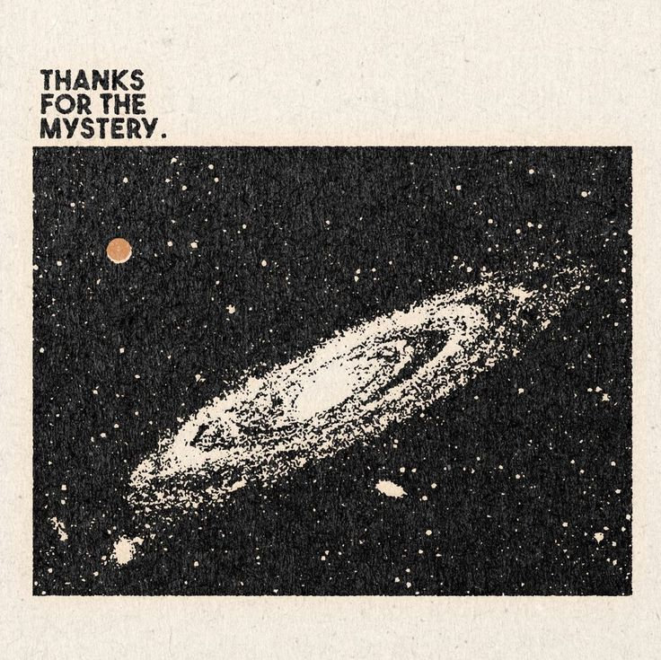

***I am Nikhil***

<strong>Software • AI & ML Student • Developer • Builder</strong>

 

## About Me

**Computer Science student specializing in Artificial Intelligence & Machine Learning** at **Chandigarh University, India**.

Currently focused on:
 

- AI & Machine Learning
- Full-Stack Development
- C/C++
- Databases
- Building real-world projects

## Languages

## Frameworks & Libraries

## Tools & Platforms

## Projects

### 📚 FocusStudy (TooCozy.com)

 

A cozy study-space web application designed to make studying more focused and relaxing, featuring a study timer, customizable themes, and immersive background environments.
           
`HTML` `CSS` `JavaScript`

[Live App](https://focusstudy-nine.vercel.app/)

### 🛒 Marketplace

A full-stack marketplace platform with authentication, product management, user profiles, and database integration.

`Next.js` `React` `Supabase`

[Live App](https://qolox-market.vercel.app/) · [Code](https://github.com/voyagerelev-cmyk/Qolox-coco)

## Connect With Me

> **"My dream was to be in Nasa </3."**

